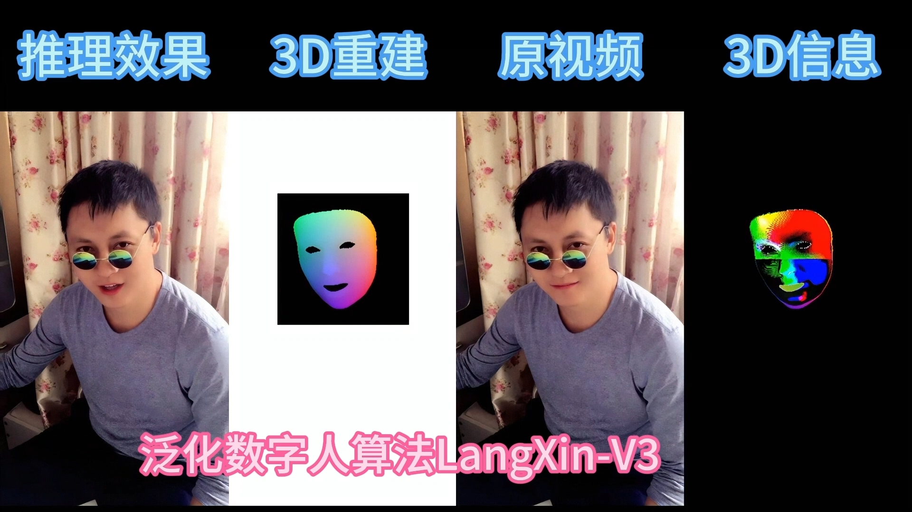

# 🚀 LangQing
### SOTA  Digital Human Platform , 
### LangQing digital human videos in 1080p, 2K, and 4K resolutions.
### 一个超保真还原本人牙齿和嘴型的商用泛化数字人项目，SOTA级。
## 🏗️ LangQing digital human

  <b>
    <a href="https://www.bilibili.com/video/BV1VsRZB9ESh/?spm_id_from=333.1387.upload.video_card.click">Video </a>
    |     
    <a href="https://github.com/langzizhixin">Project Page</a>
    |
    <a href="https://github.com/langzizhixin/LangXin">Code</a> 
  </b>

 

## 📊 Project Poster

  
    
  
## 📊 Application Scenarios

  
    
  

# 👍  Advantages
1. Ultra-realistic reproduction of my own teeth and mouth shape.
2. support 1080p, 2K, and 4K resolutions.
3. 3D head modeling.
4. fast inference speed

# 🔥 Features
- High concurrency deployment
- High-definition commercial non-real-time digital avatar
  

## 🎬 Demo

<table class="center">
  <tr style="font-weight: bolder;text-align:center;">
        <td width="50%"><b>  demo   video</b></td>
        <td width="50%"><b>  demo   video</b></td>
  </tr>
  <tr>
    <td>
      <video src=https://github.com/user-attachments/assets/768cc291-a655-477a-817a-e0ed2c269ab0 controls preload></video>
    </td>
    <td>
      <video src=https://github.com/user-attachments/assets/a785c061-ac14-4a7a-856d-da8f71e9271f controls preload></video>
    </td>
  </tr>
  <tr>
    <td>
      <video src=https://github.com/user-attachments/assets/39237994-8c4f-4df8-9419-01d2f8b8073c controls preload></video>
    </td>
    <td>
      <video src=https://github.com/user-attachments/assets/2f2e5b7f-face-4d40-93dc-02cfe79605cb controls preload></video>
    </td>
  <tr>
</table>

## 📖 Disclaimers
This repositories made by langzizhixin from Langzizhixin Technology company 2026.5.13, in Chengdu, China .
For business cooperation, please contact us by email 277504483@qq.com, or add ours WeChat for communication: langzizhixinkeji 

## 📱 商务合作请加微信联系

  
    
